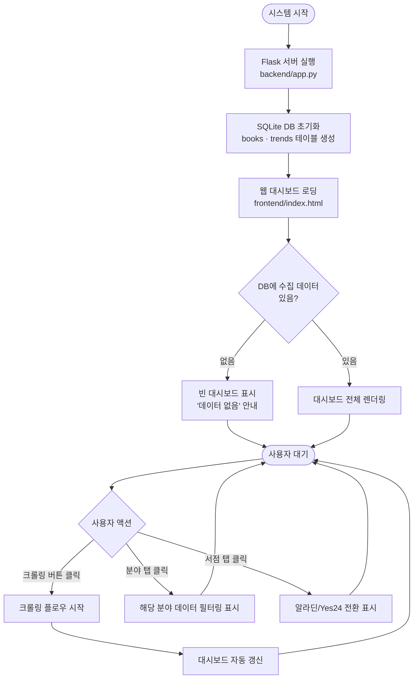
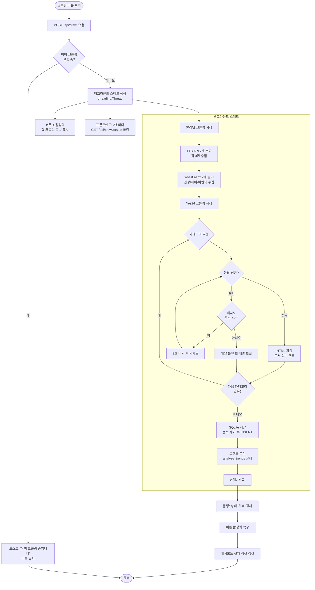
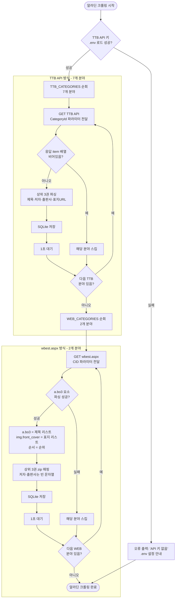
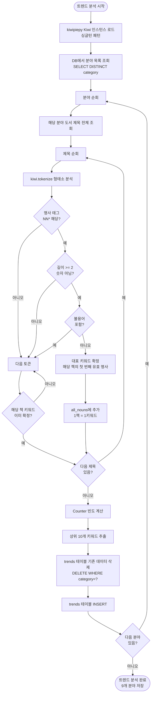
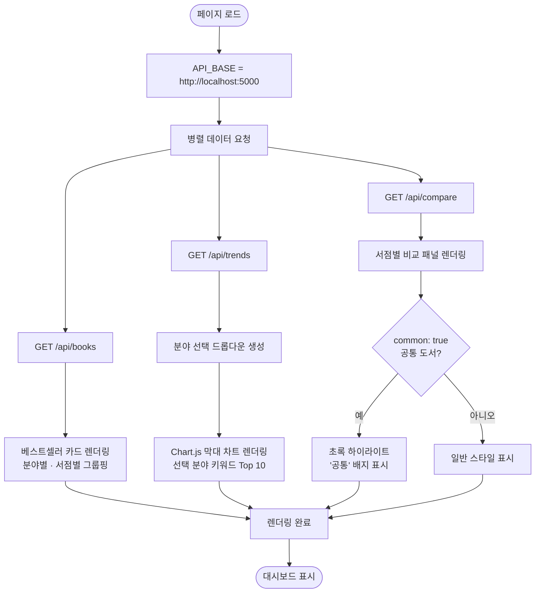

# BookTrend 플로우차트

## 1. 전체 시스템 플로우



---

## 2. 크롤링 플로우 (비동기 백그라운드)



---

## 3. 알라딘 크롤링 상세 플로우



---

## 4. Yes24 크롤링 상세 플로우

```mermaid
flowchart TD
    A([Yes24 크롤링 시작]) --> B[CATEGORIES 9개 분야 순회]
    B --> C[_make_url 호출\ncategoryNumber + 현재연도 적용]
    C --> D[GET weekbestseller\ntimeout=20s]
    D --> E{HTTP 응답\n성공?}
    E -- 성공 --> F[BeautifulSoup HTML 파싱]
    E -- 실패 --> G{시도 횟수\n< 3?}
    G -- 예 --> H[3초 대기]
    H --> D
    G -- 아니오 --> I[빈 배열 반환]

    F --> J[.itemUnit 목록 추출]
    J --> K{itemUnit\n비어있음?}
    K -- 예 --> I
    K -- 아니오 --> L[각 itemUnit에서 파싱\nem.ico.rank = 순위\na.gd_name = 제목\n.info_auth = 저자\ndata-original = 표지URL]
    L --> M[상위 3권 필터]
    M --> N{표지 URL\ndata-original 존재?}
    N -- 예 --> O[URL 내 /L → /XL 변환]
    N -- 아니오 --> P[상품 페이지에서 goods_id 추출\nhttps://image.yes24.com/goods/{id}/XL]
    O --> Q[SQLite 저장]
    P --> Q
    Q --> R{다음 분야\n있음?}
    R -- 예 --> B
    R -- 아니오 --> S([Yes24 크롤링 완료])
    I --> R
```

---

## 5. NLP 트렌드 분석 플로우



---

## 6. 대시보드 렌더링 플로우


