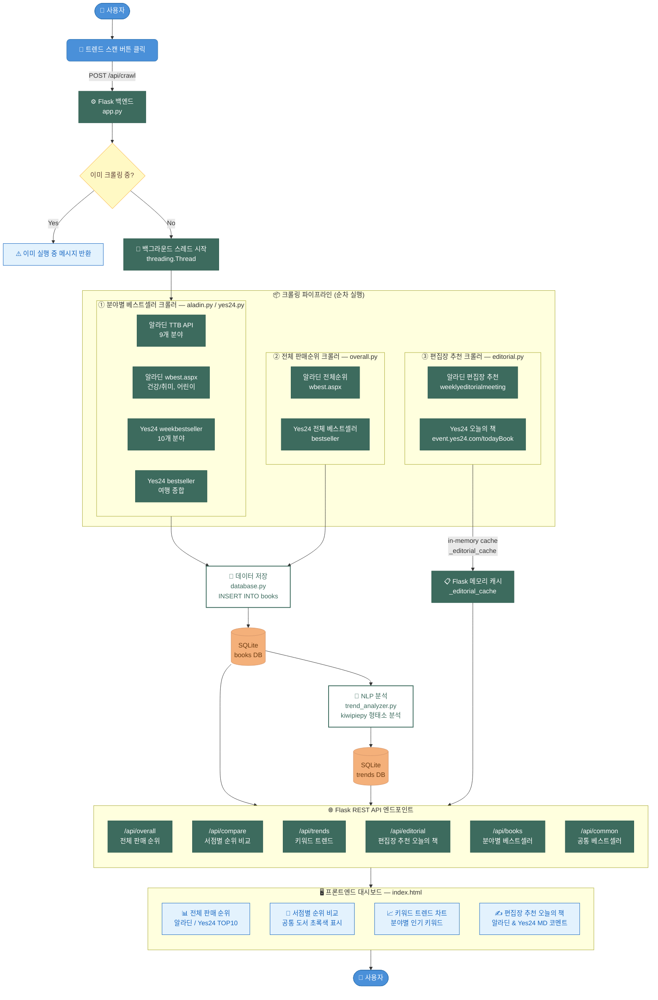

# BookTrend 시스템 플로우차트



---

## 시스템 구성 요약

| 구분 | 파일 | 역할 |
|------|------|------|
| **백엔드** | `backend/app.py` | Flask 서버, REST API, 크롤링 스케줄 |
| **분야 크롤러** | `crawler/aladin.py` | 알라딘 TTB API + wbest.aspx (11개 분야) |
| **분야 크롤러** | `crawler/yes24.py` | Yes24 weekbestseller + bestseller (11개 분야) |
| **전체순위 크롤러** | `crawler/overall.py` | 알라딘·Yes24 전체 판매 TOP 순위 |
| **편집장 크롤러** | `crawler/editorial.py` | 알라딘 편집장 추천 + Yes24 오늘의 책 |
| **NLP 분석** | `analysis/trend_analyzer.py` | kiwipiepy 형태소 분석 → 키워드 빈도 추출 |
| **DB 초기화** | `db/database.py` | SQLite 테이블 생성, 커넥션 관리 |
| **프론트엔드** | `frontend/index.html` | 단일 HTML 대시보드 (Vanilla JS) |

## 데이터 흐름 요약

```
외부 웹사이트 → 크롤러 (requests + BeautifulSoup)
    → SQLite books DB (최신 크롤링 날짜만 표시)
    → NLP 분석 (kiwipiepy)
    → SQLite trends DB

편집장 페이지 → 편집장 크롤러 → Flask 메모리 캐시 (_editorial_cache)

SQLite books DB  ┐
SQLite trends DB ┼→ Flask REST API → 프론트엔드 대시보드
Flask 메모리 캐시┘
```

## 주요 설계 결정 사항

- **최신 날짜 필터링**: 크롤링 시마다 기존 데이터를 삭제하지 않고 보존.  
  `WHERE DATE(crawled_at) = (SELECT MAX(DATE(crawled_at)) FROM books)` 조건으로 항상 최신 데이터만 표시.

- **편집장 추천 in-memory 저장**: DB 저장 없이 Flask 프로세스 메모리에 캐싱.  
  서버 재시작 시 자동으로 재크롤링.

- **Yes24 여행 분야 예외 처리**: `BESTSELLER_URL_OVERRIDES` 딕셔너리로  
  여행만 weekbestseller 대신 종합 bestseller 엔드포인트 사용.

- **백그라운드 크롤링**: `threading.Thread(daemon=True)` 로 논블로킹 실행.  
  `/api/crawl/status` 폴링으로 프론트엔드에서 진행 상황 표시.
